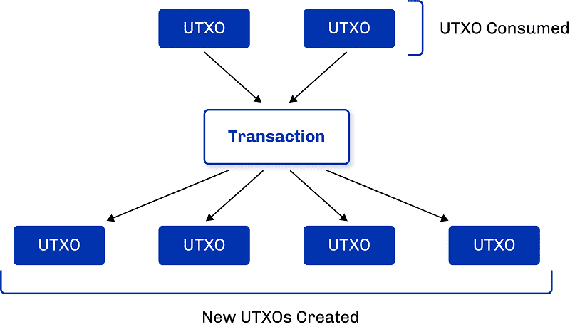

# UTXO Model

The unspent transaction output (UTXO) model defines a ledger state where balances are not directly associated with addresses but with the outputs of transactions. In this model, transactions specify the outputs of previous transactions as inputs, which are consumed in order to create new outputs.

## What is UTXO?

An Unspent Transaction Output (UTXO) is the technical term for the amount of digital currency that remains after a cryptocurrency transaction. They are recorded in the UTXO database and used in later transactions. You can think of it as the change you receive after buying an item, but it is not a lower denomination of the currency—it is a transaction output in the database generated by the network to allow for non-exact change transactions.

UTXOs use public key cryptography to identify and transfer ownership between holders of public/private key pairs. UTXOs are formatted with the recipient's public key, thus restricting the ability to spend that UTXO to the account that can prove ownership of the associated private key.

- UTXO is unique and different from each other.
- UTXOs are processed continuously and are part of the beginning and end of each transaction.
- A transaction can have multiple inputs and multiple outputs(<https://blockchair.com/bitcoin/transaction/044e32f5e01d70333fb84b744cb936bf49acab518282c111894b18bcf3a63c12>)
- During a transsaction, all inputs are consumed entirely and spent, new outputs are generated as unspent.

## How an UTXO transaction works?

When you initiate a transaction through your wallet, UTXOs with your information are located, unlocked, and the new owner's information is associated with the UTXO you transferred to them. They are locked once again, and that user can use them in transactions via the same process.

Assume Alice wants to transfer 8 ZEN to Bob, and she controls a single UTXO worth ten ZEN. The transaction she creates consumes her previously unspent transaction output \(UTXO_1\) as an input.

To spend a UTXO, it needs to be "unlocked."

The Pubkey Script included in each transaction output defines the spending conditions. The data necessary to satisfy this script is provided with the spending transaction and includes the digital signature of the owner - in this case Alice.

Next, she defines what should happen to her money. She does this by creating transaction outputs.

Alice wants to transfer 8 ZEN to Bob, so she creates two outputs:

One paying Bob
And another returning the excess money to a self-controlled address.
For both outputs, the spending conditions are also defined in the transaction created by Alice.

And then the transaction will be sent out, broadcasted, propagated and validated and executed.

### Transaction Fees

Note how the sum of outputs doesn’t equal the entirety of the consumed input. The difference between outputs and inputs is defined as the transaction fee on the protocol level.

The transaction fee’s size is estimated by the wallet based on the amount of data recorded on-chain.

Miners can only place a limited amount of data within a block, and by using the metric ‘money per amount of data,’ miners can determine which transactions to include in the block. They will typically pick the transactions with the highest fees per byte.

### How to check balance

The UTXO model does not create an “account” for you to maintain a balance. There is no final balance stored on the ledgerbut only individual transactions. So the “burden” of maintaining a user’s balance is shifted to the client-side: wallets.

Wallets maintain a record of all addresses controlled by a user and monitor the blockchain for all associated transactions. To check your balance, wallet scans the ledger for all transactions associated to your address(es) and the sum of all unspent transaction outputs determines the current balance.

## References

<https://www.horizen.io/academy/utxo-vs-account-model/#comparing-the-utxo-and-account-model>
<https://river.com/learn/bitcoins-utxo-model/>
<https://www.investopedia.com/terms/u/utxo.asp>
